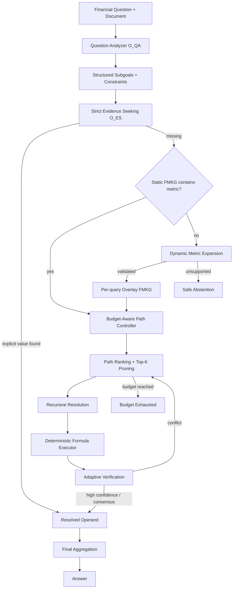

# AdaGBFR：动态、预算感知的金融图约束推理框架

> **研究原型，非 GBFR 官方仓库。** 本项目基于 ACL 2026 Main Long Paper：**Achieving Multi-Hop Calculation and Safe Abstention in Financial Numerical Reasoning by Metric Graph Constrained LLMs**，面向论文明确指出的两个限制——**FMKG 图覆盖依赖**与**多路径推理 Token 开销**——实现一个可直接做消融、长尾覆盖和成本实验的 AdaGBFR 原型。

官方 GBFR：`https://github.com/aolaoban/Graph-Bounded_Financial_Reasoning`

---

## 1. 为什么做 AdaGBFR

GBFR 将金融数值推理写成一个证据有界的神经符号问题：给定金融文档 `D`、问题 `Q` 和金融指标知识图 `G`，系统只在存在合法、可验证的推导路径时输出数值，否则安全拒答。

原论文的核心结构包括：

- **FMKG（Financial Metric Knowledge Graph）**：金融指标分为原子指标和派生指标；派生指标包含一个或多个公式、依赖关系和别名；
- **O_QA**：问题分析，将自然语言问题转换为推理类型、运算符、子目标及实体/时间/单位约束；
- **O_ES**：证据查找，只允许从上下文中抽取显式数值，不允许偷偷计算；
- **O_MD**：指标分解，从 FMKG 获取候选计算路径并递归展开；
- **O_PE**：程序执行，将已经验证的操作数代入确定性计算；
- **Cross-path Verification**：多条路径计算后进行一致性验证；若证据缺失或路径均不合法，则返回拒答。

论文公开的 FMKG 包含 **7,521 个指标节点、20,152 条依赖边**，其中 4,203 个为派生指标；约 **40.85%** 的派生指标拥有多个合法公式，最大推导深度为 6。原论文同时报告，在 FinanceReasoning 上 GBFR 平均探索约 1.53 条路径，但平均仍需约 **7,281 tokens/query**；论文在 Limitations 中明确指出：

1. **Graph Dependency**：FMKG 中不存在的长尾/新指标会直接触发拒答；
2. **Token Overhead**：多路径探索与跨路径验证增加 Token 成本。

AdaGBFR 对这两个问题分别增加 **Dynamic Metric Expansion（DME）** 和 **Budget-Aware Path Controller（BAPC）**。

---

## 2. AdaGBFR 的创新框架

### 2.1 创新一：Query-time Dynamic Metric Expansion（DME）

原 GBFR 附录已经讨论了 FMKG 的**离线更新流程**：收集新指标、对齐已有节点、诱导公式、跨来源核验并由专家确认后写回知识图。AdaGBFR 不把这一点包装成新的贡献，而是在此基础上实现不同的机制：

**只在当前查询真正遇到图覆盖缺口时，在线构建一个临时、带来源证据的 Overlay Graph。**

```text
Query / Subgoal
      |
      v
Static FMKG lookup
      |
   missing?
      |
      v
Authoritative Source Retrieval
      |
      v
Metric / Formula / Dependency induction
      |
      v
Syntax + provenance + confidence + cycle validation
      |
      +---- invalid ----> Safe Abstention
      |
     valid
      |
      v
Per-query Overlay FMKG
      |
      v
Continue graph reasoning
```

关键设计：

- **不直接写回静态 FMKG**：动态节点只存在于本次 query 的 overlay，查询结束后即丢弃；
- **保留 provenance**：每个动态节点和公式都记录 `source_ids`、`confidence` 和 `origin`；
- **保守验证**：公式无法解析、来源不足、置信度不足、存在自依赖/环、指标名称不匹配时全部拒绝加入；
- **Promotion Log**：候选节点可写入 `logs/dynamic_candidates.jsonl`，供后续人工审核后再离线合并到正式 FMKG；
- **安全优先**：如果外部来源无法明确支持公式，则不依赖 LLM 参数记忆补公式，直接拒答。

这使论文中的“持续人工维护图谱”进一步变成可以实验验证的 **query-time coverage recovery** 问题。

### 2.2 创新二：Budget-Aware Path Controller（BAPC）

原 GBFR 为保证完整性，会探索多个公式路径并进行跨路径验证。AdaGBFR 在真正调用证据抽取/LLM 之前先进行一个廉价路径预估：

```text
Score(path)
 = w_evidence * EvidenceCoverage
 + w_trust    * FormulaTrust
 - w_depth    * GraphDepthPenalty
 - w_cost     * ExpectedCost
```

默认权重：

```yaml
w_evidence: 0.52
w_trust: 0.28
w_depth: 0.10
w_cost: 0.10
```

然后采用：

1. **Best-first path exploration**：优先计算最可能被当前文档支持的路径；
2. **Top-K pruning**：默认每个指标最多保留 3 条候选公式；
3. **Early Stop**：已经获得高置信、且剩余路径没有近似同分的竞争路径时提前结束；
4. **Near-tie protection**：如果第二条路径分数接近第一条，则继续验证，避免“便宜路径优先”破坏可靠性；
5. **Hard reasoning budget**：限制 LLM 调用数、Token 数、估算美元成本和全局路径数；
6. **Budget-aware abstention**：预算耗尽单独返回 `budget_exhausted`，不与“数据真的不存在”混为一谈。

### 2.3 辅助优化：Deterministic Formula Execution

本项目对可以结构化解析的金融公式直接使用白名单 AST 解释器执行，不再为每个普通算式额外调用 LLM 生成 Python。仅允许 `+ - * / ** %`、一元正负号、`abs/min/max/round`、数值常量与已经解析出的依赖变量。不允许文件、网络、`eval/exec`、import、属性访问和任意函数调用。

该模块主要属于工程层的低成本优化；论文主创新仍建议聚焦 **DME + BAPC**。

---

## 3. 总体架构



---

## 4. 代码结构

```text
AdaGBFR/
├── adagbfr/
│   ├── budget.py              # Token/API/路径预算控制
│   ├── config.py              # YAML 配置读取
│   ├── datasets.py            # FinQA/TAT-QA/FinanceReasoning/CFBenchmark 适配
│   ├── dynamic_expansion.py   # DME：查询时动态图扩展
│   ├── evidence.py            # 严格证据抽取：规则优先 + LLM fallback
│   ├── evaluation.py          # 快速迭代评测
│   ├── factory.py             # 根据 YAML 构建完整 pipeline
│   ├── formula.py             # 安全公式解析与确定性执行
│   ├── knowledge.py           # 静态 FMKG + Query Overlay Graph
│   ├── llm.py                 # OpenAI-compatible API + token accounting
│   ├── path_ranker.py         # BAPC 路径评分和剪枝
│   ├── pipeline.py            # 主流程与最终聚合
│   ├── question.py            # O_QA 问题结构化
│   ├── resolver.py            # 递归图推理、early stop、cross-path consensus
│   ├── schemas.py             # 数据结构与状态定义
│   ├── source_retriever.py    # 本地 BM25 风格来源检索
│   └── verification.py        # deterministic / LLM / adaptive 验证
├── configs/
│   ├── demo.yaml
│   ├── adagbfr.yaml
│   ├── static_budget.yaml
│   └── dynamic_exhaustive.yaml
├── data/
│   ├── demo_kb.json
│   ├── demo_sources.jsonl
│   └── demo_questions.jsonl
├── scripts/
│   ├── prepare_gbfr_assets.py
│   ├── build_source_corpus.py
│   ├── make_longtail_kb.py
│   ├── run_demo.py
│   └── run_benchmark.py
└── tests/
```

---

## 5. 环境配置

### 5.1 推荐环境

- Linux / Windows 均可
- Python **3.10 或 3.11**
- 不要求 Neo4j：AdaGBFR v0.1 默认使用内存图索引，从而降低复现实验门槛
- 完整 benchmark 建议使用一个 OpenAI-compatible Chat Completion endpoint
- 推荐先与原论文保持一致，使用 **Qwen3-14B** 作为主要开源 backbone；也可以接入 vLLM / SGLang / Ollama 暴露的兼容接口

### 5.2 安装

```bash
git clone https://github.com/1781988/AdaGBFR.git
cd AdaGBFR

python -m venv .venv
source .venv/bin/activate        # Linux/macOS
# .venv\Scripts\activate         # Windows PowerShell

pip install -r requirements.txt
pip install -e .
pytest
```

当前测试不需要 GPU、Neo4j 或 API。

---

## 6. 先跑通无 API Demo

Demo 故意从静态图中删除 `Gross Margin`，但在 `demo_sources.jsonl` 中提供：

```text
Gross Margin = Gross Profit / Revenue
```

上下文：

```text
Revenue: $1,000
Gross Profit: $400
```

运行：

```bash
python scripts/run_demo.py --config configs/demo.yaml --case dynamic_margin
```

预期：

```text
status = answer
value = 0.4
answer = 40.00%
dynamic_requests = 1
dynamic_accepts = 1
```

验证安全拒答：

```bash
python scripts/run_demo.py --config configs/demo.yaml --case safe_abstention
```

该样例只有 Net Income 和 Ending Equity，没有 Beginning/Average Equity，预期：

```text
status = evidence_absent
value = null
```

---

## 7. 配置真实 FMKG

本仓库不重新分发 GBFR 的完整 7,521 节点知识库和 benchmark 数据。请单独获取官方仓库：

```bash
mkdir -p external
git clone https://github.com/aolaoban/Graph-Bounded_Financial_Reasoning.git external/gbfr
```

转换官方 FMKG：

```bash
python scripts/prepare_gbfr_assets.py \
  --gbfr-root external/gbfr \
  --output data/gbfr/fmkg.json
```

AdaGBFR 归一化后的结构：

```json
{
  "metrics": [
    {
      "name": "Return on Equity",
      "aliases": ["ROE"],
      "definition": "...",
      "formulas": [
        {
          "expression": "Return on Equity = Net Income / Average Equity",
          "dependencies": ["Net Income", "Average Equity"],
          "confidence": 1.0,
          "origin": "static"
        }
      ]
    }
  ]
}
```

> 转换器优先保留显式公式；如果某些复杂 FMKG 公式不能被安全 AST 执行器解析，该路径会失败而不是执行不受信任代码。此类公式应在 v0.2 中用受限程序编译器补齐。

---

## 8. 配置 Dynamic Expansion 外部来源

DME 的原则是：**未知指标不能靠模型记忆直接补全，必须有检索来源。**

来源文件使用 JSONL：

```json
{"source_id":"src_001","title":"Gross Margin","text":"Gross Margin = Gross Profit / Revenue","authority":0.95,"url":"..."}
```

配置：

```yaml
reasoning:
  dynamic:
    enabled: true
    source_path: data/gbfr/source_corpus.jsonl
    top_k_sources: 5
    min_confidence: 0.84
    min_sources: 1
    use_llm_fallback: true
```

### 8.1 受控长尾实验 Source Corpus

先验证“图覆盖缺失 → 动态恢复”机制时，可在**屏蔽节点之前**从完整 FMKG 构造检索语料：

```bash
python scripts/build_source_corpus.py \
  --kb data/gbfr/fmkg.json \
  --output data/gbfr/source_corpus.jsonl
```

**重要：这属于 controlled stress test，不应作为论文唯一主实验。** 因为来源文本来自完整 FMKG，本质上提供了较强的 oracle knowledge。论文主实验至少再加入一组**独立来源**（公开金融百科、教材/专业资料或独立金融公式库），否则 dynamic recovery 容易被审稿人质疑 knowledge leakage。

---

## 9. LLM / 本地模型配置

完整实验默认使用 OpenAI-compatible endpoint：

```yaml
llm:
  enabled: true
  model: qwen3-14b
  base_url: http://127.0.0.1:8000/v1
  api_key_env: OPENAI_API_KEY
  temperature: 0.0
```

```bash
export OPENAI_API_KEY=EMPTY
```

为了公平比较，**GBFR 和 AdaGBFR 必须使用同一 backbone、temperature、上下文、benchmark split 和最大输出长度。**

---

## 10. Benchmark 数据配置与运行

当前 loader 与原 GBFR 公开代码保持同类字段约定：

| Dataset | Question | Context | Answer | Table |
|---|---|---|---|---|
| FinQA | `question` | `context` | `answer` | `table` |
| TAT-QA | `question` | `context` | `answer` | `table` |
| FinanceReasoning | `question` | `context` | `ground_truth` | - |
| CFBenchmark | `question` | `context` | `answer` | - |

先跑 FinQA 50 条：

```bash
python scripts/run_benchmark.py \
  --config configs/adagbfr.yaml \
  --dataset FinQA \
  --data-root external/gbfr/data/FinQA \
  --limit 50 \
  --seed 42 \
  --output results/finqa_adagbfr.jsonl
```

完整数据：

```bash
python scripts/run_benchmark.py \
  --config configs/adagbfr.yaml \
  --dataset FinQA \
  --data-root external/gbfr/data/FinQA \
  --output results/finqa_adagbfr_full.jsonl
```

会生成详细 JSONL 与 summary JSON。

> 内置 numeric matching 用于快速迭代。正式论文表格应继续使用各 benchmark 官方评测，并复现 GBFR 原论文的 precision normalization 规则。

---

## 11. 建议的正式实验设计

### RQ1：能否在不损失准确率的情况下减少推理成本？

主对比：`PoT / RAG / ReAct / Official GBFR / AdaGBFR`。

至少报告：

- Total Accuracy
- Abstention Accuracy
- Average Input/Output/Total Tokens
- LLM Calls / Query
- Paths Considered / Executed
- Latency / Query
- API Cost / Query
- Accuracy per 1K tokens
- Token/Cost reduction vs. GBFR

### RQ2：动态扩展能否缓解 Graph Dependency？

先构造 source corpus，再生成 10%、20%、30%、40% 的派生指标缺失图：

```bash
python scripts/make_longtail_kb.py \
  --kb data/gbfr/fmkg.json \
  --ratio 0.10 \
  --seed 42 \
  --output data/gbfr/fmkg_mask10.json
```

依次测试：`Static GBFR-like reasoning / +DME / +DME+BAPC`。

新增指标：

- **Graph Coverage Recovery Rate**
- **Dynamic Expansion Acceptance Precision**
- **False Expansion Rate**
- **Abstention under Missing Knowledge**

最终论文不要只随机 mask；建议再补一个按指标频率/领域分层的 **Long-tail split**。

### RQ3：BAPC Cost–Accuracy Trade-off

建议 sweep：

```text
max_paths_per_metric = 1 / 2 / 3 / 5 / exhaustive
early_stop           = on / off
max_total_tokens      = 4k / 8k / 12k / 16k
```

主图：`Accuracy vs Average Tokens`、`Abstention Accuracy vs Average Tokens`。

### RQ4：组件消融

| Variant | DME | Path Ranking/Pruning | Early Stop | Adaptive Verification |
|---|---:|---:|---:|---:|
| Static-Exhaustive | ✗ | ✗ | ✗ | LLM |
| + DME | ✓ | ✗ | ✗ | LLM |
| + BAPC | ✗ | ✓ | ✓ | ✓ |
| **AdaGBFR** | ✓ | ✓ | ✓ | ✓ |

仓库提供：

```text
configs/static_budget.yaml
configs/dynamic_exhaustive.yaml
configs/adagbfr.yaml
```

正式复现 **Official GBFR** 时，请直接运行原作者代码，不要把本仓库的 Static-Exhaustive 误写成官方 GBFR。

### RQ5：小模型鲁棒性

至少跑：`Qwen3-14B` 主结果 + 一个更小本地模型 + 一个强模型性能上界。重点观察 DME 在小模型上的错误扩展率。

---

## 12. Safe Abstention 状态定义

```text
answer            已得到证据有界的数值答案
evidence_absent   指标存在，但上下文与所有合法推导路径均缺关键证据
graph_coverage    静态图缺指标，且动态扩展无法可靠恢复
budget_exhausted  理论上可能继续推理，但触及实验预算
conflict          多条可信路径出现不可消解的数值冲突
invalid_plan      O_QA 输出结构不合法
execution_error   程序异常
```

正式计算 Abstention Accuracy 时可按实验定义映射为 `⊥`，但分析阶段建议保留失败原因，从而区分 graph coverage、真实证据缺失和预算限制。

---

## 13. 当前 v0.1 已实现 / v0.2 待做

### 已实现

- 静态 FMKG 内存索引与 alias lookup
- Per-query overlay graph
- BM25 风格本地来源检索
- Rule-first + LLM-fallback 动态指标扩展
- 来源/置信度/公式语法/环路检查
- Strict direct evidence extraction
- 递归指标分解
- Budget-aware path ranking
- Top-K pruning
- Near-tie-aware early stop
- 硬 Token/API/path budget
- 安全 AST 公式执行
- adaptive verification
- cross-path numerical consensus
- 四个金融 benchmark 轻量 data loader
- 长尾 mask 工具
- 成本日志、快速评测、无 API tests/demo

### v0.2 建议补齐

1. 原 FMKG 复杂公式的受限程序编译器；
2. 独立公开金融资料 source corpus；
3. metric expansion second verifier / two-source agreement；
4. 经过审核的动态节点 cache；
5. 原论文有限 1-hop upward algebraic rearrangement；
6. dynamic node confidence calibration / risk-coverage curve；
7. 完整 counterfactual evaluation 与 McNemar significance test。

---

## 14. 推荐 6–8 周开发顺序

```text
Week 1  跑通官方 GBFR + Qwen3-14B；跑通 AdaGBFR demo/FinQA 50
Week 2  FMKG complex-formula compatibility；四数据集 sanity check
Week 3  10/20/30/40% long-tail masking；DME recovery
Week 4  BAPC path/token sweep；确定 top-k/early-stop/confidence
Week 5  完整 FinQA + FinanceReasoning；再跑 TAT-QA/CFBenchmark
Week 6  Ablation + small-model + failure analysis
Week 7  独立 source corpus + 显著性检验 + 图表
Week 8  论文写作与投稿自检
```

时间紧时优先完成 **FinQA + FinanceReasoning + long-tail coverage + cost/accuracy curve**。

---

## 15. 复现注意事项

- 不要只报告 Accuracy；本工作的核心是 **accuracy / abstention / cost / graph coverage** 四者共同变化；
- 不要把完整 FMKG 生成的 source corpus 当作唯一动态知识源；
- 不要让 DME 自动永久写回 base FMKG；
- 不要把 `budget_exhausted` 解释成“文档证据不存在”；
- 商业 API 实验需填写真实 `input_price_per_million / output_price_per_million`；
- Official GBFR 数字应从原作者代码重新运行获得。

---

## 16. Citation

```bibtex
@inproceedings{jiang-etal-2026-achieving,
  title     = {Achieving Multi-Hop Calculation and Safe Abstention in Financial Numerical Reasoning by Metric Graph Constrained LLMs},
  author    = {Jiang, Aoyuan and Hong, Liang and Liu, Haoxuan and Wang, Rui},
  booktitle = {Proceedings of the 64th Annual Meeting of the Association for Computational Linguistics (Volume 1: Long Papers)},
  year      = {2026},
  pages     = {27575--27595}
}
```

如果基于 AdaGBFR 继续形成论文，建议先保持方法名和论文标题为临时状态，等 long-tail recovery 与 cost–accuracy 实验跑完后再决定最终命名。